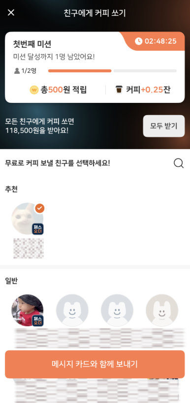

# 02. 친구에게 커피 쏘기: 수신자 확인 마찰 줄이기

## 문제 인식
메시지 작성 화면에서 받는 사람이 “N명의 친구”로만 표시됩니다.

이 경우 수신자 확인을 위해 뒤로가기를 반복할 가능성이 있습니다.

## 가설
수신자 이름을 작성 화면에서 바로 보여주면,
뒤로가기 행동이 줄고 전송까지의 흐름이 단순해질 수 있습니다.

## A/B 설계
- A안: 받는 사람 인원수만 표기
- B안: 받는 사람 이름 노출 (다수 수신 시 펼침)

## 지표
### Primary
1) 뒤로가기 클릭률
- 분자: 메시지 작성 단계에서 뒤로가기를 누른 세션 수
- 분모: 메시지 작성 페이지 진입 세션 수

2) 다이렉트 전송률
- 분자: 뒤로가기 없이 메시지 전송 완료한 세션 수
- 분모: 메시지 작성 페이지 진입 세션 수

### Guardrail
- 메시지 작성 페이지 이탈률
- 분자: 메시지 전송 없이 페이지를 이탈한 세션 수
- 분모: 메시지 작성 페이지 진입 세션 수

## 판단 기준
- Ship: 뒤로가기 클릭률 감소 + 다이렉트 전송률 증가 + 이탈률 악화 없음
- Hold: Primary 일부만 개선되거나 이탈률 악화
- Kill: 개선이 확인되지 않음
