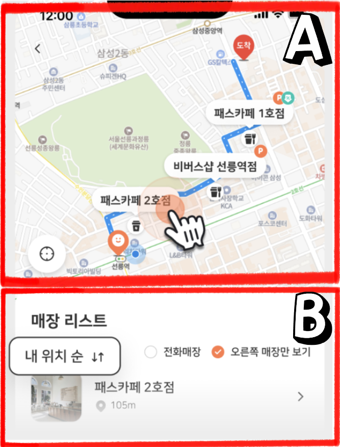
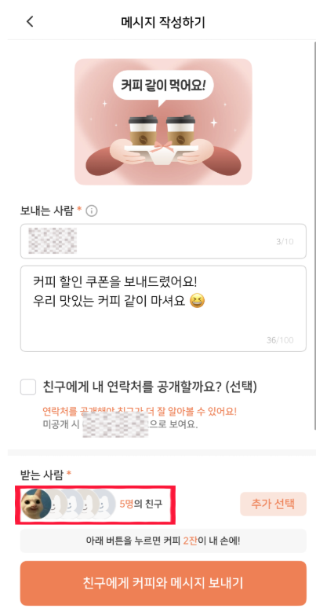
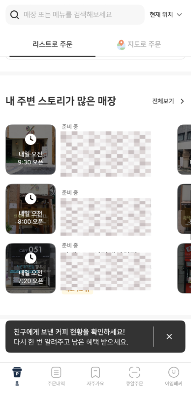

# 2026-02-20 | 패스오더 실험 설계 기록 (풀텍스트)

실서비스를 그냥 ‘사용’만 하지 않고, 제가 느낀 문제를 실험 가능한 가설로 바꿔보는 개인 프로젝트를 시작했습니다.

이번이 첫 기록이고, 주제는 "패스오더" 입니다.
오늘은 3가지 실험 + 1가지 핵심 지표를 정리했습니다.

────────────────────────

## 1) 경유 매장: ‘따로 노는’ 지도와 리스트 — 분절된 탐색 경험 통합

### 문제
- 목적지를 찍으면 지도(상단)와 매장 리스트(하단)가 같이 보이지만, 서로 연동 되지 않음
- 지도를 줌인/이동해도 리스트는 그대로
- 리스트를 목적지순으로 정렬해도 지도는 그대로
- 한쪽에 집중하는 순간 다른 한쪽은 “전시용(죽은 기능)”이 되어, 모바일 화면을 낭비하고 탐색 집중도를 분산시킴

### 가설
- 탐색 시작 단계에서 [출발 / 중간 지점 / 목적] 탭을 먼저 선택하게 하고,
- 선택된 기준점에 맞춰 지도를 자동 줌인 + 리스트를 실시간 동기화(Sync)하면,
- 탐색 비용이 줄어 최종 매장 선택까지 걸리는 시간(Time-to-Select)이 단축된다.

### 실험 설계
A안(기존)
- 지도-리스트 비연동
 - 지도 이동해도 리스트 고정
 - 리스트 정렬해도 지도 고정

B안(개선)
- [출발 / 중간 지점 / 목적] 지점 선택 탭 제공
- 양방향 동기화(Bidirectional Sync)
 - 지도 이동(뷰포트 변화) → 리스트가 해당 범위 기준으로 필터/정렬 업데이트
 - 리스트 선택/정렬 → 지도가 해당 위치로 이동/줌인

### 측정 지표
Primary
- Time-to-Select
 - 목적지 입력 완료 → 최종 매장 선택까지 총 소요 시간

Guardrail (기술 부하/로딩)
- 동기화 로직 때문에 렉/로딩이 늘어 구매까지 오히려 늦어지지 않는지
 - 예: 매장 선택 → 결제 완료까지 소요 시간
 - (가능하면) 지도/리스트 업데이트 지연 이벤트, API 에러율 같은 성능 지표도 함께 감시

### 판단
- Ship: Time-to-Select 단축 + 지연/성능 악화 없음
- Hold: 선택은 빨라졌지만 지연(렉/구매시간) 악화
- Kill: 개선 없음 또는 전반 악화

────────────────────────

## 2) 친구에게 커피 쏘기: 수신자 확인 “불안” 줄이기

### 문제(왜 불안한가)
- 메시지 작성 화면에서 수신자가 “N명의 친구”로만 보이면,
 - 연락처에 민감한 사람(직장/거래처/가족 등)도 섞여 있을 수 있어
 - “혹시 잘못 선택했나?”를 즉시 확인하기 어려움
- 뒤로가기 → 명단 재확인 → 재진입 같은 추가 행동이 생기고, 전송 흐름이 끊길 수 있음

### 가설
- 수신자 이름을 목록 형태로 확인 가능하게(토글/펼침) 만들면,
- 재확인 행동이 줄고 전송이 더 매끄럽게 이어진다.

### 실험 설계
A안(기존)
- 수신자 “N명”만 표기

B안(개선)
- “이름 일부 + 펼침 토글로 전체 목록 노출”
- 토글을 열면 수신자 전체를 목록화해서 보여주고, 즉시 삭제/수정 가능

### 측정 지표
Primary
- 뒤로가기 클릭률(메시지 작성 단계)
- 다이렉트 전송률(뒤로가기 없이 전송 완료)

Guardrail (부작용)
- 작성 → 전송까지 소요시간(목록 UI가 오히려 느리게 만들지)
- 수신자 수정/삭제 비율(진단용)

### 판단
- Ship: 뒤로가기 ↓ + 다이렉트 전송 ↑ + 이탈/소요시간 악화 없음

────────────────────────

## 3) 스토리(리뷰) 답글: “효과 수치 제시”가 점주 행동을 바꾸는가

### 핵심 질문
- 답글을 잘 다는 매장은 단골 전환이 더 높은가?
- 그 근거를 점주에게 보여주면, 실제로 답글 행동이 늘어나는가?
- 그리고 그 변화가 단골 전환까지 이어지는가?

### 1단계: 관찰(상관 확인)
- 고답글 매장 vs 저답글 매장 비교
- 지표: 단골 전환율
 - 분자: 첫 주문 후 4주 내 3회 이상 재주문 고객 수
 - 분모: 해당 매장 첫 주문 고객 수
- 관찰은 상관 확인용(인과 결론은 2단계에서 확인)

### 2단계: 개입 A/B(인과 확인)
A안
- 일반 운영 안내

B안
- 1단계에서 확인된 결과를 “수치로” 제시 + 답글 유도 CTA

“답글 효과 수치 메시지” 예시(카피)
- “사장님, 최근 4주 기준 ‘답글을 단 매장’의 단골 전환율이 더 높았습니다(예: +3.1%p). 지금 올라온 리뷰에 답글을 달아볼까요?” [답글 달기]
- “리뷰 후 24시간 내 답글을 단 경우 재주문 전환이 더 높게 나타났어요(예: +X%). 이번 리뷰부터 적용해보세요.” [답글 달기]

### 측정 지표
Primary
- 점주 답글률(답글 등록 리뷰 수 / 전체 리뷰 수)

Outcome
- 단골 전환율(위 정의 동일)

### 판단
- Ship: 답글률 ↑ + 단골 전환율 개선까지 확인
- Hold: 답글률은 ↑ 하지만 단골 전환 개선 불명확
- Kill: 답글률 개선 없음

────────────────────────

## 보너스) 패스오더 아이덴티티와 연결되는 핵심 지표

“패스오더는 카페와 고객을 연결하는 가장 효과적인 홍보 채널입니다”이라는 문구를 보고, 저는 “그 연결이 성공했는지 어떤 숫자로 확인할까?”를 떠올렸습니다.

그래서 플랫폼 전체가 아닌 점포별 지표를 택했습니다. 점주에게 중요한 건 하나, 패스오더로 처음 온 손님이 다시 오는가입니다.
연결은 점주(품질 자신감)와 고객(취향 발견·재방문) 관점이 맞물릴 때 완성된다고 봤습니다.
- ‘패스오더로 처음 온 손님이 내 가게에 다시 오는가?’

여기서 ‘연결’은 점주만의 이야기가 아니라, 고객 관점에서도 완성된다고 봤습니다.
- 점주 관점: “우리 집 원두(퀄리티) 진짜 자신 있는데, 이걸 알아주는 손님을 더 만나고 싶다”
- 고객 관점: “내 취향에 맞는 카페를 새로 발견했고, 다시 찾을 이유가 생겼다(단골이 됐다)”
- 즉, 점주의 자부심(품질)이 고객의 취향(재방문)으로 번역될 때 ‘연결’이 성공했다고 말할 수 있습니다.

제가 고른 지표: 점포별 단골 전환율(Regular Conversion Rate)
- 정의: 패스오더로 해당 점포에 첫 주문한 고객 중, 4주(28일) 내 3회 이상 재주문한 비율
- 의미: “발견 → 첫 경험 → 재방문 고착”이 점포 단위에서 일어났는지 보여주는 가장 정직한 숫자

즉, 점포별 단골 전환율이 올라간다면 패스오더는 ‘홍보 채널’이라는 자부심을 점주와 고객 양쪽 관점의 결과로 증명할 수 있다고 봅니다.

────────────────────────
