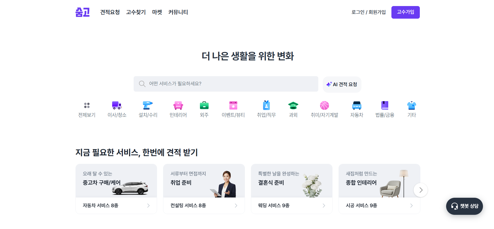
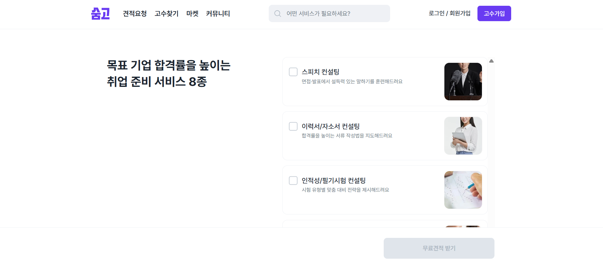
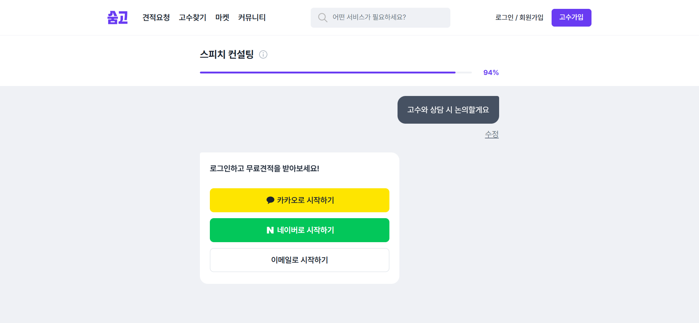
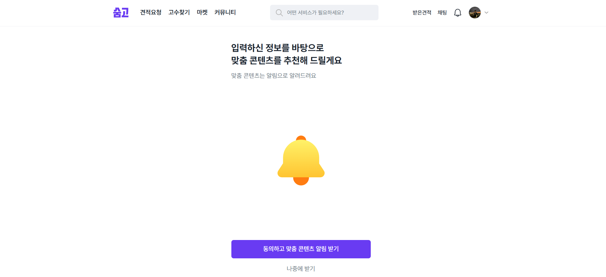
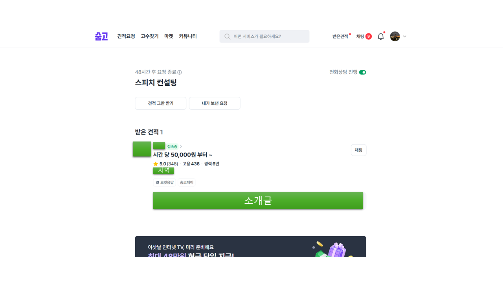
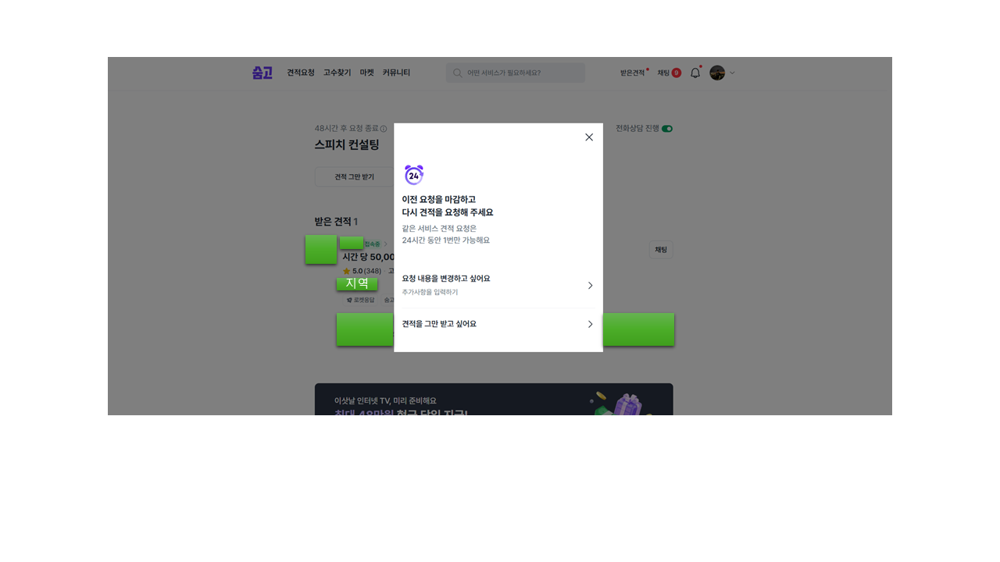
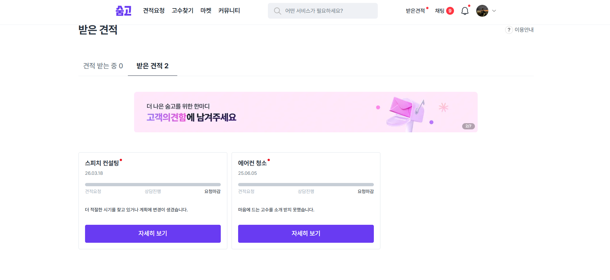

# 2026-03-22 | '숨고' 스피치 컨설팅 견적 요청 플로우 이벤트 QA

> 내부 이벤트 스키마와 수집 파이프라인에 직접 접근할 수 없는 상황에서, **Amplitude Event Explore**를 활용해 실제 브라우저에서 발생한 이벤트를 관찰하고, `Observed Tracking Plan`과 QA 검증 포인트를 정리한 프로젝트입니다.

---

## 1. 왜 이 프로젝트를 했는가

데이터 QA를 제대로 이해하려면 결국 **이벤트가 실제로 어떻게 수집되는지**를 봐야 한다고 생각했습니다.  
하지만 서비스의 내부 스키마 문서, Amplitude 프로젝트 설정, warehouse 테이블에는 접근할 수 없습니다.

그래서 이번 스터디에서는 접근 가능한 관찰 수단인 **Amplitude Event Explore**를 활용해,

- 숨고 플랫폼 내에서 어떤 이벤트가 실제로 발생하는지
- 어떤 파라미터가 함께 붙는지
- 어떤 지점에서 QA 관점의 검증 포인트가 생기는지

를 직접 정리해보는 방식으로 접근했습니다.

이 프로젝트의 초점은 **제한된 관찰 환경에서 로그 QA 관점으로 이벤트 수집 상태를 읽어내는 과정**에 있습니다.

---

## 2. 관찰 대상 플로우

이번에 관찰한 흐름은 숨고의 **취업 준비 프리셋 진입 후, 스피치 컨설팅 견적 요청을 진행하는 사용자 여정**입니다.

관찰 범위는 아래와 같습니다.

1. 메인 홈 진입
2. 취업 준비 프리셋 진입
3. 스피치 컨설팅 선택 및 요청폼 진행
4. 게스트 사용자의 로그인 게이트 노출
5. 제출 후 알림 동의 화면 노출
6. 받은 견적 화면 진입
7. 견적 취소/종료 상태 확인

### 이번 글에서 제외한 범위

- 메인 홈 하단의 추천 고수/광고 카드 영역
- 요청폼 중간 step 전체 스크린샷
- 내부 spec이 없으면 확정할 수 없는 canonical 해석

즉, 이 글은 **관찰 사실 기반의 흐름 정리 + QA 포인트 도출**에 집중합니다.

---

## 3. 플로우를 따라가며 무엇을 관찰했는가

### 3-1. 메인 홈에서 취업 준비 프리셋으로 진입

숨고 메인 홈에서 시작했습니다.  
이번 프로젝트의 관심사는 홈 전체가 아니라, **취업 준비 프리셋을 통해 견적 요청 플로우로 진입하는 흐름**이었습니다.

이 구간에서는 홈 진입, 프리셋 섹션 노출, 실험 콘텐츠 노출, 개인화 타입 할당이 함께 관찰됐습니다.

화면에서 관찰된 이벤트 / 핵심 파라미터 보기

| Event | Observed params |
| --- | --- |
| `View Main` | `Member Type=guest`, `location=others` |
| `view_customer_preset_main_page` | `preset_id[]`, `preset_name[]`, `user_type=guest` |
| `abtest_otg_818_content_display` | `current_page_name=고객홈_페이지`, `user_type=guest` |
| `assign_personalization_type` | `location_page=main`, `purpose=content_personalization`, `type=inactive_user` |

프리셋 섹션 노출(`view_customer_preset_main_page`)은 `preset_id`, `preset_name`을 배열로 한 번에 수집한다는 점에서, 개별 카드마다 이벤트를 생성하기보다 **프리셋 목록 전체를 한 이벤트로 관리하는 방식**으로 판단됩니다. 이런 구조는 카드별 이벤트를 반복적으로 쌓지 않아도 되고, 프리셋 순서와 같은 변경사항이 생겨도 이벤트명을 다시 나누지 않아도 된다는 점에서 효율적인 로그 설계라고 생각합니다. 만약 index별 또는 카드별 개별 이벤트로 쪼갰다면 노출 순서 변경이나 구성 변경 시 schema 관리가 더 복잡해졌을 가능성을 함께 떠올릴 수 있었습니다.

또한 `abtest_otg_818_content_display`와 개인화 타입 할당(`assign_personalization_type`)이 함께 관찰된다는 점에서, 제가 본 홈 화면 역시 실험 조건이나 개인화 로직이 반영된 하나의 버전이었을 가능성이 있습니다. 이번 raw sample에는 variant를 직접 식별할 수 있는 파라미터가 없어 확정할 수는 없지만, 다른 사용자나 다른 시점에서는 일부 다른 홈 구성이 노출되었을 가능성을 함께 열어두고 해석했습니다.

다만 홈 하단에 있는 추천 카드/광고 영역은 이번 포트폴리오 핵심 흐름과 직접 연결되지 않는다고 판단해, 본문 서술에서는 제외했습니다.

> 즉, 홈 화면을 전부 분석한 것이 아니라 **견적 요청 플로우 진입과 직접 연결되는 이벤트만 선택적으로 추적**했습니다.

---

### 3-2. 취업 준비 프리셋 안에서 스피치 컨설팅 선택

취업 준비 프리셋에 진입한 뒤, 사용자는 세부 서비스 중 **스피치 컨설팅**을 선택해 요청폼으로 들어가게 됩니다.

화면에서 관찰된 이벤트 / 핵심 파라미터 보기

| Event | Observed params |
| --- | --- |
| `customer_total_request_open` | `preset_id=취업 준비`, `preset_name=취업 준비`, `service_count=8`, `total_request_type=preset`, `location=customer_main_page_click_preset_carousel_item` |
| `Start Request Form` | `Form ID`, `Service ID=404`, `Service Name=스피치 컨설팅`, `requestServiceId[]`, `content_category[]`, `content_ids=404`, `form_type=chat_request` |
| `click_request_form_step_next_button` | `request_form_id`, `step_index`, `step_type`, `selected_answer`, `is_last_step` |

이 흐름에서 `customer_total_request_open`은 **취업 준비 프리셋 페이지에 진입했다는 사실**을 보여주는 이벤트이고, 그 페이지에서 무료견적 받기를 누르면 `Start Request Form`이 켜지는 구조를 확인하였습니다.

또한 `Start Request Form`에는 `requestServiceId`, `content_category`, `content_ids`가 함께 붙어 있어, 단순히 “폼이 열렸다”기보다 **어떤 서비스 맥락으로 폼이 시작됐는지**를 같이 전달하는 구조로 보였습니다. 이어서 `click_request_form_step_next_button`에 `request_form_id`가 붙는다는 점에서, 이 값은 현재 작성 중인 요청폼을 구분하는 식별자로 추측됩니다. 예를 들어 같은 스피치 컨설팅 요청이라도 폼을 연 시점과 작성 흐름은 매번 달라질 수 있기 때문에, `request_form_id`는 “지금 작성 중인 이 폼 묶음”을 식별하는 값처럼 이해하는 것이 자연스러웠습니다. 이때 `step_index`는 질문 의미 자체라기보다, 현재 폼 안에서 사용자가 몇 번째 단계를 진행 중인지 보여주는 순서 값으로 봤습니다.

---

### 3-3. 게스트 사용자의 로그인 게이트 노출

이번 관찰은 **게스트 상태에서 시작한 사용자 흐름**이었기 때문에, 제출 직전에 로그인 게이트가 노출됐습니다.

화면에서 관찰된 이벤트 / 핵심 파라미터 보기

| Event | Observed params |
| --- | --- |
| `view_request_sign_in_step` | `sep_device_id`, `soomgo_session_id` |
| `$identify` | `Member Type=user`, `Allow Push=true`, `Allow SMS=true`, `Allow Email=true` |
| `complete_user_sign_in` | `Account Type=Kakao`, `Member Type=user`, `Login Method=manual` |

이 구간에서는 로그인 게이트 노출(`view_request_sign_in_step`)과 로그인 완료(`complete_user_sign_in`)가 차례로 관찰됐습니다. 이를 통해 숨고의 요청 퍼널은 비로그인 사용자에게 완전히 닫혀 있다기보다, **요청 제출 직전에 인증 단계를 삽입하는 구조**로 읽을 수 있었습니다.

또한 로그인 완료 직전에는 `$identify` 이벤트가 연이어 관찰되며 `Member Type=user`, `Allow Push=true` 같은 사용자 속성이 갱신됐습니다. 즉 이 구간은 단순히 로그인 버튼을 눌렀다는 사실만 남기는 것이 아니라, **게스트 상태의 사용자가 인증을 거치며 회원 상태로 전환되는 과정**까지 함께 기록하는 구간으로 볼 수 있었습니다.

---

### 3-4. 제출 후 알림 동의 화면

요청 제출 이후에는 맞춤 콘텐츠 또는 알림 동의 성격의 후속 화면이 나타났습니다.

이 구간에서 raw 기준으로 직접 확인된 이벤트는 `customer_info_input_start`였습니다.  
하지만 화면에서 보이는 사용자의 선택지에 비해, 이를 세부적으로 설명해주는 후속 이벤트는 이번 샘플에서 명확하게 확인되지 않았습니다.

그래서 이 부분은 다음처럼 정리했습니다.

- 실제 화면은 존재함
- 시작 이벤트는 관찰됨
- 하지만 후속 선택 이벤트는 명확히 분리해 설명하기 어려움

즉, 이 구간은 **후속 계측이 충분한지 확인이 필요한 영역**으로 남겼습니다.

---

### 3-5. 받은 견적 화면 진입

제출 이후에는 받은 견적 영역으로 이어졌습니다.

이 구간에서는 다음 이벤트를 확인했습니다.

- `view_received_quote_list_page`
- `customer_landing_im`

이를 통해 단순히 요청 제출까지만 본 것이 아니라,
**제출 이후 사용자가 실제로 도달하는 받은 견적 리스트 화면까지 이벤트 흐름이 이어지는지**를 확인할 수 있었습니다.

또한 이 구간은 `request_id`를 기준으로 제출 이후 흐름을 이어서 볼 수 있다는 점에서 의미가 있었습니다.

---

### 3-6. 견적 취소/종료 상태 확인

받은 견적 리스트 이후에는 개별 견적 확인과 요청 종료/취소 관련 흐름도 이어서 확인했습니다.

이 구간에서는 다음 이벤트를 관찰했습니다.

- `view_received_quote_page`
- `complete_request_close_confirmation`

이를 통해 요청 종료 사유와 종료 상태가 어떤 식으로 이벤트에 반영되는지 확인할 수 있었습니다.

즉, 이번 프로젝트는 단순히 “요청을 보냈다” 수준에서 끝나지 않고,
**받은 견적 확인 → 종료 상태 확인**까지 후속 행동 흐름을 함께 본 프로젝트였습니다.

---

## 4. 관찰을 통해 확인한 이벤트 구조

이번 관찰에서 직접 확인한 주요 이벤트는 아래와 같습니다.

- 홈 진입: `View Main`
- 프리셋 노출: `view_customer_preset_main_page`
- 프리셋 진입: `customer_total_request_open`
- 요청 시작: `Start Request Form`
- 요청폼 진행: `click_request_form_step_next_button`
- 로그인 게이트: `view_request_sign_in_step`
- 로그인 완료: `complete_user_sign_in`
- 요청 제출: `send_request_finished`, `Submit Request`
- 제출 후 후속 화면: `customer_info_input_start`
- 받은 견적: `view_received_quote_list_page`, `customer_landing_im`, `view_received_quote_page`
- 요청 종료: `complete_request_close_confirmation`

이 흐름을 통해, 실제 서비스의 이벤트가 단순 page view 중심이 아니라
**시작 / 진행 / 인증 / 제출 / 후속 행동** 구조로 쌓인다는 점을 확인할 수 있었습니다.

---

## 5. 그래서 어떤 QA 포인트를 도출했는가

이번 프로젝트에서 중요한 건 “버그를 찾았다”가 아니라,
**어떤 지점을 검증해야 할지 근거를 만들었다**는 점입니다.

### 5-1. 표기 불일치 확인

관찰 과정에서 동일한 의미로 보이지만 표기 방식이 다른 필드가 보였습니다.

- `Member Type` vs `user_type`
- `Location` vs `location`
- `Service ID` vs `serviceId`
- `Service Name` vs `serviceName`

이것이 곧바로 잘못된 수집이라고 단정되지는 않지만,
분석과 QA 관점에서는 **표준화 필요 포인트**가 됩니다.

### 5-2. 반복 관찰 이벤트 확인

다음 이벤트는 동일하거나 매우 유사한 payload로 반복 관찰됐습니다.

- `view_request_sign_in_step`
- `customer_landing_im`
- 일부 `click_request_form_step_next_button`

이 역시 오류 확정이 아니라,
**중복 firing / 재렌더링 / 정상 재노출 여부를 구분하는 검증 포인트**로 볼 수 있습니다.

### 5-3. step sequence 확인

요청폼 이벤트에서 `step_index`는 샘플 기준으로 아래 값이 관찰됐습니다.

- `1, 2, 4, 5, 7, 8, 9, 10`

즉 `3, 6`은 이번 샘플에서 직접 보지 못했습니다.  
하지만 이것을 곧바로 누락 오류로 해석하면 안 됩니다.

가능한 해석은 다음과 같습니다.

- 특정 답변에 따라 step이 건너뛰어지는 conditional branching
- 이번 관찰 과정에서 놓친 step 존재
- 실제 미계측

따라서 이 구간은 **sequence QA 후보**로 남겼습니다.

### 5-4. 연결 키 확인

요청폼 단계에서는 `request_form_id`가 핵심처럼 보였고,
제출 이후에는 `request_id`가 핵심처럼 보였습니다.

즉,

- pre-submit: `request_form_id`
- post-submit: `request_id`

구조로 나뉘어 보였고,
둘 사이를 직접적으로 이어주는 bridge key가 충분한지 검토할 필요가 있겠다고 판단했습니다.

### 5-5. 후속 화면 계측 확인

알림 동의 화면처럼,
실제 UI는 존재하지만 raw에서 세부 후속 이벤트가 충분히 구분되지 않는 영역도 있었습니다.

이런 구간은 **미계측인지 / 샘플 누락인지 / 단일 이벤트로만 수집하는 설계인지**를 점검해야 하는 영역이라고 볼 수 있습니다.

---

## 6. 결론

이 프로젝트는 단순히 “숨고 이벤트를 몇 개 봤다”는 기록이 아닙니다.

오히려,

- 실제 이벤트 수집 결과를 직접 관찰하고
- 관찰 결과를 Tracking Plan 형태로 구조화하고
- 오류를 섣불리 단정하지 않으면서도 QA 검증 포인트를 도출하고
- 이후 데이터 가이드라인과 SQL 검증으로 확장 가능한 기준을 만드는

**로그 QA 학습 프로젝트**로 보는 것이 더 정확합니다.

이 과정을 통해 보여주고 싶은 역량도 분명합니다.

- 제한된 환경에서도 로그를 관찰하고 구조화하는 능력
- 이벤트를 단순 나열이 아니라 QA 관점의 검증 포인트로 읽어내는 능력
- Observed Tracking Plan을 이후 Canonical Tracking Plan과 검증 문서로 연결하는 능력

즉, 입사 후에도 이런 방식으로
**로그 구조 점검 / Tracking Plan 정리 / QA 포인트 도출 / 검증 기준 문서화**에 기여할 수 있음을 보여주는 프로젝트로 정리했습니다.
