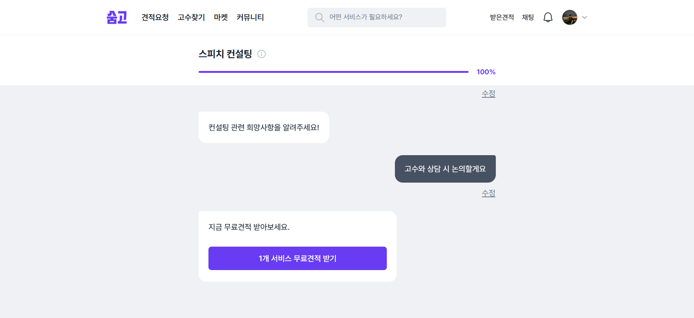

# 2026-03-18 | '숨고' 스피치 컨설팅 견적 요청 플로우 이벤트 QA

> 내부 이벤트 스키마와 수집 파이프라인에 직접 접근할 수 없는 상황에서, **Amplitude Event Explore**를 활용해 실제 브라우저에서 발생한 이벤트를 관찰하고, `Observed Tracking Plan`과 QA 검증 포인트를 정리한 프로젝트입니다.

---

## 1. 왜 이 프로젝트를 했는가

데이터 QA를 제대로 이해하려면 결국 **이벤트가 실제로 어떻게 수집되는지**를 봐야 한다고 생각했습니다.  
하지만 서비스의 내부 스키마 문서, Amplitude 프로젝트 설정, warehouse 테이블에는 접근할 수 없습니다.

그래서 이번 스터디에서는 접근 가능한 관찰 수단인 **Amplitude Event Explore**를 활용해,

- 숨고 플랫폼 내에서 어떤 이벤트가 실제로 발생하는지
- 어떤 property가 함께 붙는지
- 어떤 지점에서 QA 관점의 검증 포인트가 생기는지

를 직접 정리해보는 방식으로 접근했습니다.

이 프로젝트의 초점은 **제한된 관찰 환경에서 로그 QA 관점으로 이벤트 수집 상태를 읽어내는 과정**에 있습니다.

---

## 2. 관찰 대상 플로우

이번에 관찰한 흐름은 숨고의 **취업 준비 프리셋 진입 후, 스피치 컨설팅 견적 요청을 진행하는 사용자 여정**입니다.

관찰 범위는 아래와 같습니다.

1. 메인 홈 진입
2. 취업 준비 프리셋 진입
3. 스피치 컨설팅 선택 및 요청폼 진행
4. 게스트 사용자의 로그인 게이트 노출
5. 제출 후 알림 동의 화면 노출
6. 받은 견적 화면 진입
7. 견적 취소/종료 상태 확인

### 이번 글에서 제외한 범위

- 메인 홈 하단의 추천 고수/광고 카드 영역
- 요청폼 중간 step 전체 스크린샷
- 내부 spec이 없으면 확정할 수 없는 canonical 해석

즉, 이 글은 **관찰 사실 기반의 흐름 정리 + QA 포인트 도출**에 집중합니다.

---

## 3. 플로우를 따라가며 무엇을 관찰했는가

### 3-1. 메인 홈에서 취업 준비 프리셋으로 진입

숨고 메인 홈에서 시작했습니다.  
이번 프로젝트의 관심사는 홈 전체가 아니라, **취업 준비 프리셋을 통해 견적 요청 플로우로 진입하는 흐름**이었습니다.

이 구간에서는 홈 진입, 프리셋 섹션 노출, 실험 콘텐츠 노출, 개인화 타입 할당이 함께 관찰됐습니다.

화면에서 관찰된 이벤트 / 핵심 property 보기

| Event | Observed properties |
| --- | --- |
| `View Main` | `Member Type=guest`, `location=others` |
| `view_customer_preset_main_page` | `preset_id[]`, `preset_name[]`, `user_type=guest` |
| `abtest_otg_818_content_display` | `current_page_name=고객홈_페이지`, `user_type=guest` |
| `assign_personalization_type` | `location_page=main`, `purpose=content_personalization`, `type=inactive_user` |

프리셋 섹션 노출(`view_customer_preset_main_page`)은 `preset_id`, `preset_name`을 배열로 한 번에 수집한다는 점에서, 개별 카드마다 이벤트를 생성하기보다 **프리셋 목록 전체를 한 이벤트로 관리하는 방식**으로 판단됩니다. 이런 구조는 카드별 이벤트를 반복적으로 쌓지 않아도 되고, 프리셋 순서와 같은 변경사항이 생겨도 이벤트명을 다시 나누지 않아도 된다는 점에서 효율적인 로그 설계라고 생각합니다. 만약 index별 또는 카드별 개별 이벤트로 쪼갰다면 노출 순서 변경이나 구성 변경 시 schema 관리가 더 복잡해졌을 가능성을 함께 떠올릴 수 있었습니다.

또한 `abtest_otg_818_content_display`와 개인화 타입 할당(`assign_personalization_type`)이 함께 관찰된다는 점에서, 제가 본 홈 화면 역시 실험 조건이나 개인화 로직이 반영된 하나의 버전이었을 가능성이 있습니다. 이번 raw sample에는 variant를 직접 식별할 수 있는 property가 없어 확정할 수는 없지만, 다른 사용자나 다른 시점에서는 일부 다른 홈 구성이 노출되었을 가능성을 함께 열어두고 해석했습니다.

다만 홈 하단에 있는 추천 카드/광고 영역은 이번 포트폴리오 핵심 흐름과 직접 연결되지 않는다고 판단해, 본문 서술에서는 제외했습니다.

> 즉, 홈 화면을 전부 분석한 것이 아니라 **견적 요청 플로우 진입과 직접 연결되는 이벤트만 선택적으로 추적**했습니다.

---

### 3-2. 취업 준비 프리셋 안에서 스피치 컨설팅 선택

취업 준비 프리셋에 진입한 뒤, 사용자는 세부 서비스 중 **스피치 컨설팅**을 선택해 요청폼으로 들어가게 됩니다.

화면에서 관찰된 이벤트 / 핵심 property 보기

| Event | Observed properties |
| --- | --- |
| `customer_total_request_open` | `preset_id=취업 준비`, `preset_name=취업 준비`, `service_count=8`, `total_request_type=preset`, `location=customer_main_page_click_preset_carousel_item` |
| `Start Request Form` | `Form ID`, `Service ID=404`, `Service Name=스피치 컨설팅`, `requestServiceId[]`, `content_category[]`, `content_ids=404`, `form_type=chat_request` |
| `click_request_form_step_next_button` | `request_form_id`, `step_index`, `step_type`, `selected_answer`, `is_last_step` |

이 흐름에서 `customer_total_request_open`은 **취업 준비 프리셋 페이지에 진입했다는 사실**을 보여주는 이벤트이고, 그 페이지에서 무료견적 받기를 누르면 `Start Request Form`이 켜지는 구조를 확인하였습니다.

또한 `Start Request Form`에는 `requestServiceId`, `content_category`, `content_ids`가 함께 붙어 있어, 단순히 “폼이 열렸다”기보다 **어떤 서비스 맥락으로 폼이 시작됐는지**를 같이 전달하는 구조로 보였습니다. 이어서 `click_request_form_step_next_button`에 `request_form_id`가 붙는다는 점에서, 이 값은 현재 작성 중인 요청폼을 구분하는 식별자로 추측됩니다. 예를 들어 같은 스피치 컨설팅 요청이라도 폼을 연 시점과 작성 흐름은 매번 달라질 수 있기 때문에, `request_form_id`는 “지금 작성 중인 이 폼 묶음”을 식별하는 값처럼 이해하는 것이 자연스러웠습니다. 이때 `step_index`는 질문 의미 자체라기보다, 현재 폼 안에서 사용자가 몇 번째 단계를 진행 중인지 보여주는 순서 값으로 봤습니다.

---

### 3-3. 게스트 사용자의 로그인 게이트 노출

이번 관찰은 **게스트 상태에서 시작한 사용자 흐름**이었기 때문에, 제출 직전에 로그인 게이트가 노출됐습니다.

화면에서 관찰된 이벤트 / 핵심 property 보기

| Event | Observed properties |
| --- | --- |
| `view_request_sign_in_step` | `sep_device_id`, `soomgo_session_id` |
| `$identify` | `Member Type=user`, `Allow Push=true`, `Allow SMS=true`, `Allow Email=true` |
| `complete_user_sign_in` | `Account Type=Kakao`, `Member Type=user`, `Login Method=manual` |

이 구간에서는 로그인 게이트 노출(`view_request_sign_in_step`)과 로그인 완료(`complete_user_sign_in`)가 차례로 관찰됐습니다. 이를 통해 숨고의 요청 퍼널은 비로그인 사용자에게 완전히 닫혀 있다기보다, **요청 제출 직전에 인증 단계를 삽입하는 구조**로 읽을 수 있었습니다.

또한 로그인 완료 직전에는 `$identify` 이벤트가 연이어 관찰되며 `Member Type=user`, `Allow Push=true` 같은 사용자 속성이 갱신됐습니다. 즉 이 구간은 단순히 로그인 버튼을 눌렀다는 사실만 남기는 것이 아니라, **게스트 상태의 사용자가 인증을 거치며 회원 상태로 전환되는 과정**까지 함께 기록하는 구간으로 볼 수 있었습니다.

---

### 3-4. 마지막 step 완료 후 제출 이벤트 발생

> 이 구간은 마지막 step(진행률 100%) 화면과 raw event를 함께 보며 해석했습니다.

요청폼 마지막 단계에서는 사용자가 최종 답변을 입력한 뒤 `1개 서비스 무료견적 받기` 버튼을 누를 수 있었습니다. raw event 기준으로는 마지막 step 이벤트 직후 제출 관련 이벤트가 연속해서 관찰됐습니다.

관찰 이벤트 / 핵심 property

| Event | Observed properties |
| --- | --- |
| `click_request_form_step_next_button` | `request_form_id`, `step_index=10`, `is_last_step=true`, `selected_answer`, `service_id`, `service_name` |
| `send_request_finished` | `requestSendServiceId[]`, `sep_device_id`, `soomgo_session_id` |
| `Submit Request` | `request_id`, `Service ID`, `Service Name`, `content_category`, `request_type`, `form_type`, `sep_device_id`, `soomgo_session_id` |

raw log를 시간순으로 보면 마지막 `click_request_form_step_next_button`에서 `is_last_step=true`가 기록된 뒤, `send_request_finished`와 `Submit Request`가 수십 ms 간격으로 이어졌습니다. 이번 sample에서는 **마지막 step 완료 이후 제출 관련 이벤트가 연속적으로 기록되는 흐름**을 확인할 수 있었습니다.

마지막 step 이벤트에는 `request_form_id`가 남아 있습니다. `Submit Request`에서는 `request_id`가 등장합니다. 작성 중인 폼 흐름과 제출 이후 요청 흐름이 서로 다른 식별자 체계로 기록되는 것처럼 보였습니다.

특정 고객이 마지막 응답을 마치고 실제 견적 요청서를 제출하는 과정을 하나의 흐름으로 분석하려면, 이 두 식별자를 이어주는 기준이 필요해 보였습니다. 이번 sample에서는 마지막 `click_request_form_step_next_button`의 `request_form_id`와 `Submit Request`의 `request_id`를 직접 연결해주는 property는 관찰되지 않았습니다.

관찰된 row만 기준으로 보면, 이 구간은 `soomgo_session_id`와 `sep_device_id`를 함께 보며 같은 요청 흐름인지 확인하는 방식으로 읽을 수 있었습니다. 이것이 실제 내부에서 사용하는 매핑 기준인지는 이번 sample만으로는 확인할 수 없었습니다.

---

### 3-5. 제출 후 알람 동의 화면

요청 제출 이후에는 받은 견적으로 바로 넘어가기 전, 알람 동의 화면이 한 번 더 나타났습니다.

관찰 이벤트 / 핵심 property

| Event | Observed properties |
| --- | --- |
| `customer_info_input_start` | `location=request`, `sep_device_id`, `soomgo_session_id` |

이 구간에서 raw 기준으로 직접 확인된 이벤트는 `customer_info_input_start`였습니다. 실제 화면 흐름을 함께 보면, 이 이벤트는 알람 동의 화면의 시작 이벤트로 해석하는 것이 가장 자연스러웠습니다.

다만 이 화면에서 사용자가 `동의하고 맞춤 콘텐츠 알림 받기`를 눌렀는지, `나중에 받기`를 눌렀는지까지 구분해주는 후속 이벤트는 이번 raw sample에서 명확히 확인되지 않았습니다. 따라서 이 구간은 **알람 동의 화면의 시작은 관찰되지만, 버튼별 후속 액션 계측은 확인되지 않은 구간**으로 정리했습니다.

---

### 3-6. 받은 견적 화면 진입

제출 이후 전환 구간을 지나면, 사용자는 받은 견적 영역으로 이어지게 됩니다.

관찰 이벤트 / 핵심 property

| Event | Observed properties |
| --- | --- |
| `view_received_quote_list_page` | `service_id`, `service_name`, `request_id`, `category_name`, `location=requested` |
| `customer_landing_im` | `service_id`, `service_name`, `request_id` |

이 구간에서는 `view_received_quote_list_page`와 `customer_landing_im`이 연달아 관찰됐고, 두 이벤트 모두 같은 `request_id`, `service_id`, `service_name`을 공유했습니다. 이번 sample만 놓고 보면 `customer_landing_im`의 property는 `view_received_quote_list_page`의 핵심 식별 정보와 크게 다르지 않았습니다. 두 이벤트가 왜 분리되어 있는지, 각각 어떤 역할을 갖는지는 관찰만으로는 분명하게 읽히지 않았습니다.

---

## 4. 관찰을 통해 추가로 확인하고 싶은 포인트

#### 4-1. 제출 경계에서의 식별자 연결 기준 확인 필요 _(관련 구간: 3-4)_

제출 직전/직후 구간에서 관찰한 핵심 row는 아래와 같았습니다.

- `click_request_form_step_next_button`
  - `request_form_id`, `step_index`, `is_last_step`, `selected_answer`
- `send_request_finished`
  - `requestSendServiceId`, `sep_device_id`, `soomgo_session_id`
- `Submit Request`
  - `request_id`, `Service ID`, `Service Name`, `content_category`, `content_ids`, `Location`, `sep_device_id`, `soomgo_session_id`

특정 고객이 마지막 응답을 마치고 실제 견적 요청서를 제출하는 과정을 하나의 흐름으로 분석하려면, `request_form_id`와 `request_id`를 이어주는 기준이 필요해 보였습니다. 이번 sample에서는 마지막 `click_request_form_step_next_button`의 `request_form_id`와 `Submit Request`의 `request_id`를 직접 연결해주는 property는 관찰되지 않았습니다.

관찰된 row만 기준으로 보면, 이 구간은 `soomgo_session_id`와 `sep_device_id`를 함께 보며 읽어야 할 가능성이 높았습니다. 실제 내부에서 어떤 매핑 기준을 사용하는지는 추가로 확인해보고 싶었습니다.

#### 4-2. 받은 견적 진입 구간에서의 이벤트 분리 기준 의문점 _(관련 구간: 3-6)_

받은 견적 진입 직후에는 아래 두 row가 거의 연속해서 관찰됐습니다.

- `view_received_quote_list_page`
  - `service_id`, `service_name`, `request_id`, `category_name`, `location`
- `customer_landing_im`
  - `service_id`, `service_name`, `request_id`

두 번째 이벤트의 핵심 식별 정보는 첫 번째 이벤트 안에 이미 포함되어 있었습니다. 이 구간에서는 두 이벤트를 굳이 왜 나눴는지, 각각 어떤 분석 질문에 쓰는지가 가장 궁금했습니다.

#### 4-3. 알림 동의 화면에서의 액션 정보 기록 방식 확인 필요 _(관련 구간: 3-5)_

이 구간에서 Event Explore와 raw에서 직접 확인된 row는 `customer_info_input_start`였고, 보이는 property는 `location`, `sep_device_id`, `soomgo_session_id` 정도였습니다.

화면이 시작됐다는 정보는 보였습니다. 사용자가 어떤 버튼을 눌렀는지를 설명하는 action 정보는 확인되지 않았습니다. 이 정보가 실제로 어떤 이벤트나 property에 기록되는지가 궁금한 포인트로 남았습니다.

#### 4-4. 이벤트 간 property 명명 규칙의 불일치 _(관련 구간: 3-1, 3-2, 3-4, 3-6)_

row 기준으로 보면 비슷한 의미의 값이 아래처럼 서로 다른 이름으로 기록되고 있었습니다.

- 사용자 상태
  - `View Main` → `Member Type`
  - `customer_total_request_open` → `user_type`

- 서비스 정보
  - `Start Request Form` → `Service ID`, `Service Name`
  - `view_received_quote_list_page` → `service_id`, `service_name`
  - `complete_request_close_confirmation` → `serviceId`, `serviceName`

- 위치 정보
  - `View Main` → `location`
  - `customer_total_request_open` → `location`
  - `Start Request Form` → `Location`
  - `view_received_quote_list_page` → `location`

즉 같은 의미권으로 읽히는 값이 이벤트에 따라 **Title Case**, **snake_case**, **camelCase**로 섞여 있었습니다.

실무에서는 이런 차이를 허용된 legacy로 보는지, 아니면 하나의 naming convention으로 정리하는지가 궁금했습니다.

---

## 5. 실제 QA에서 검증할 로그 적재 포인트

### 5-1. 현재 sample만으로 직접 검증 가능한 QA

#### 5-1-1. form 흐름이 마지막 step까지 잘 유지되는지
- 기준: `Start Request Form.Form ID` = `click_request_form_step_next_button.request_form_id`
- 체크: step이 1부터 마지막까지 이어지는지, 마지막 step에서만 `is_last_step=true`가 찍히는지

#### 5-1-2. 사용자 응답이 step 이벤트에 잘 기록되는지
- 기준: `click_request_form_step_next_button.selected_answer`
- 체크: 화면에서 입력한 값이 `selected_answer`에 누락 없이 남는지

#### 5-1-3. 서비스 카테고리 맥락이 시작부터 중간 단계까지 일관되게 유지되는지
- 시작 row: `Start Request Form.Service ID=404`, `Service Name=스피치 컨설팅`, `requestServiceId[]=['c1-29','c2-29','404']`, `content_category[]=['c1-29','c2-29','404']`
- step row: `click_request_form_step_next_button.service_id=404`, `service_name=스피치 컨설팅`, `content_category[]=['c1-29','c2-29','404']`
- 체크: 이벤트마다 property 이름은 다르지만, 시작 row와 step row가 같은 서비스/카테고리 맥락을 유지하는지

---

## 6. 회고

이번 프로젝트는 내부 이벤트 스키마 문서나 실제 이벤트 트래킹 플랜을 직접 확인한 것이 아니라, **Amplitude Event Explore와 브라우저 화면 관찰을 바탕으로 raw event를 역으로 해석**하는 방식으로 진행했습니다. 그만큼 각 이벤트의 의미를 100% 확정적으로 해석하기 어려운 한계도 분명히 있었습니다.

그럼에도 불구하고, 실무 경험이 많지 않은 상태에서 **로그가 어떤 흐름으로 적재되고, 하나의 서비스 플로우를 이벤트 단위로 어떻게 읽어야 하는지**를 학습하는 데에는 매우 유용한 도구라고 느꼈습니다. 특히 단순히 이벤트 이름을 나열하는 것이 아니라, 서비스의 본질적인 여정을 기준으로 “어떤 로그가 핵심이고 무엇을 먼저 검증해야 하는지”를 생각해보는 훈련이 되었습니다.

이후에는 여기서 더 나아가, AI를 활용해 가상의 로그 데이터를 적재하고, SQL로 QA 기준을 검증한 뒤, Airflow 같은 도구로 이를 자동화하는 흐름까지 확장해볼 수 있겠다고 생각했습니다. 그렇게 된다면 단순 관찰 기반 포트폴리오를 넘어, **로그 설계 → 적재 검증 → 자동화된 QA 파이프라인**까지 연결하는 형태의 프로젝트로 발전시킬 수 있을 것 같습니다.
