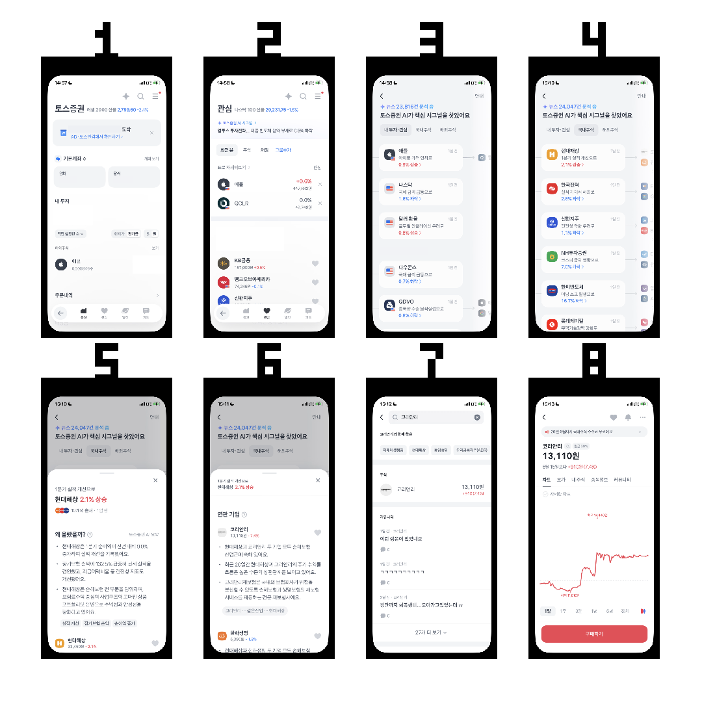
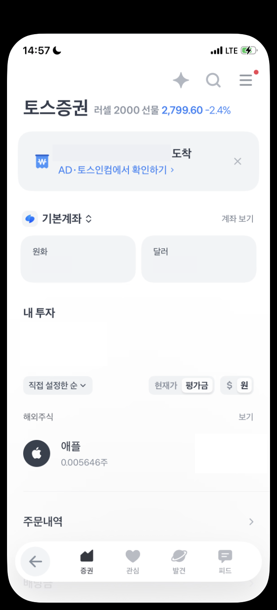
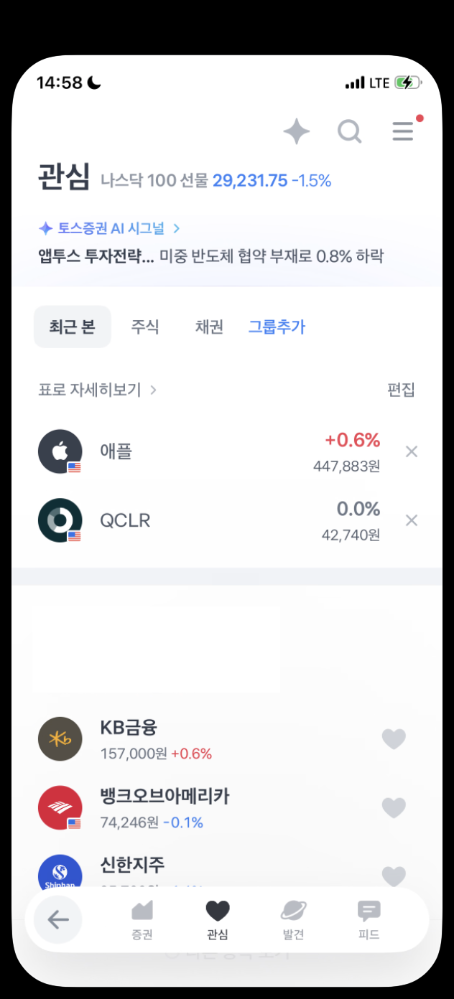
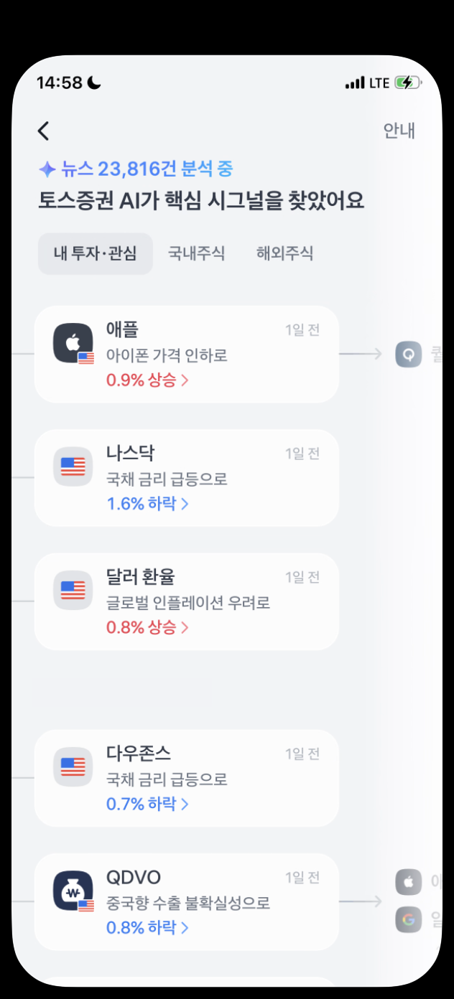
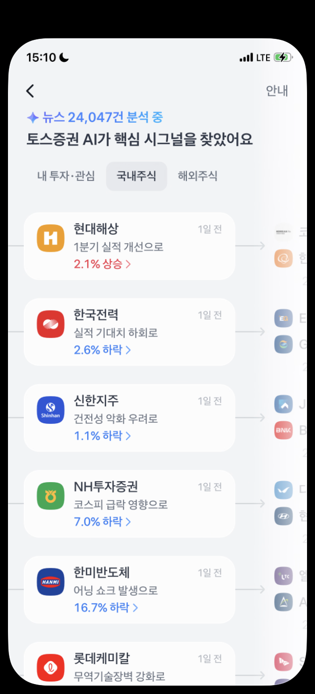
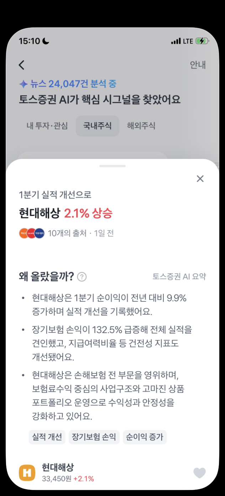
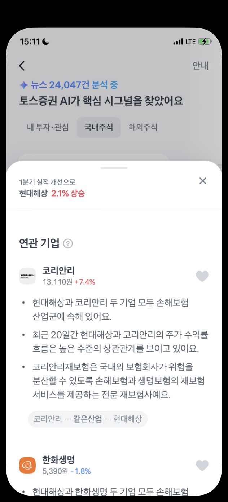
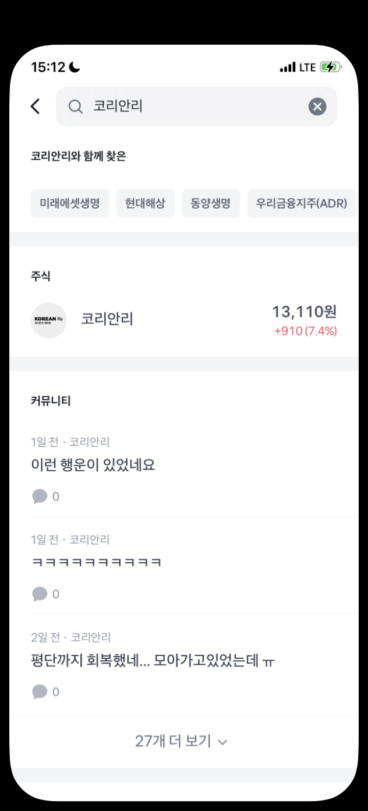
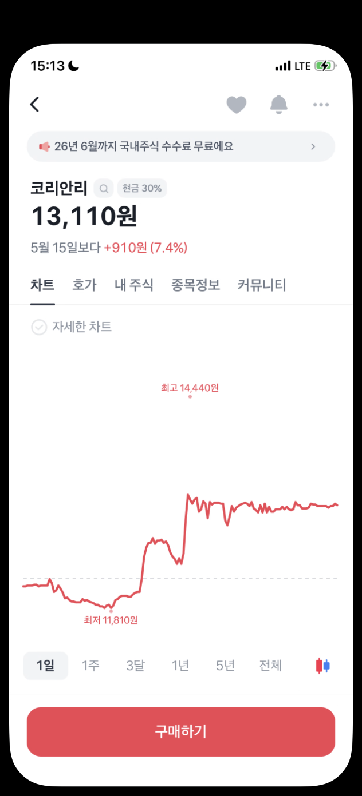

# 2026-05-17 | 토스증권 AI 시그널 탐색 플로우 이벤트 로그 설계 시나리오

> 내부 로그 스키마나 실제 데이터에 접근하지 않고, 앱 화면에서 관찰 가능한 사용자 흐름을 기준으로 **이벤트와 Global properties를 어떻게 설계하면 분석 맥락과 QA 기준을 잃지 않을지** 정리한 시나리오입니다.

---

## 1. 왜 이 프로젝트를 했는가

토스증권 Data Quality Specialist 포지션은 클라이언트 로그 품질 관리, 분석 계획에 맞는 로그 설계, 엔지니어에게 전달 가능한 스펙 작성, 테스트 케이스 작성, 로그 결함 탐지를 중요하게 봅니다.
그래서 이번 글에서는 실제 내부 데이터 조회나 입수 확인이 아니라, 공개적으로 관찰 가능한 앱 화면을 바탕으로 **AI 시그널 기능이 종목 탐색으로 이어지는 흐름을 어떻게 이벤트로 남기고 QA할지**에 집중했습니다.

Data Quality Specialist 공고 기준으로 이 글에서 보여주려는 직무 연결 역량은 아래 다섯 가지입니다.

| 직무 요구 | 이 글에서 보여주는 산출물 |
| --- | --- |
| 클라이언트 로그 품질 관리 | iOS/Android에서 이벤트 트리거 시점과 중복 적재 위험을 분리해 QA 포인트로 정리 |
| 분석 계획에 맞는 로그 설계 | `ai_signal_to_stock_detail` 퍼널 질문을 먼저 정의한 뒤 이벤트와 프로퍼티를 역으로 설계 |
| 엔지니어에게 전달 가능한 스펙 | 화면별 `view_*` 이벤트, 다음 화면으로 이어지는 `click_*` 이벤트, 이벤트별 payload를 표로 분리 |
| 테스트 케이스 작성 및 입수 확인 | 화면 전환, 탭 이동, 바텀시트 노출, 검색 결과 귀속을 검증 케이스로 정리 |
| SQL/지표 이해 | 최종 도달 이벤트, 이탈 구간, CTR/CVR 해석에 필요한 식별자와 연결 키를 명확히 설정 |

이번 산출물은 아래 수준까지만 다룹니다.

- Image #1의 1~8번 화면 기준 플로우
- 화면별 `view_*` 이벤트
- 다음 화면으로 이어지는 `click_*` 이벤트
- 모든 이벤트에 붙는 `Global properties`
- 각 화면/행동을 해석하는 이벤트별 프로퍼티
- QA 테스트 케이스와 SQL 검증 관점
- iOS/Android 구현 시 트리거 시점이 달라질 수 있는 유의점

실제 매수, 주문 완료, 내부 로그 입수 여부는 이번 범위에서 제외했습니다.

---

## 2. Image #1 기준 플로우 화면

관찰한 흐름은 **관심 탭에서 AI 시그널을 보고, 국내주식 시그널 상세와 연관 기업을 거쳐 최종 종목 상세로 이동하는 여정**입니다.

Image #1의 각 번호는 아래처럼 하나의 화면 경계로 해석했습니다.
한 화면에서는 현재 상태를 설명하는 `view_*` 이벤트와, 다음 화면을 유발하는 `click_*` 이벤트까지만 잡았습니다.

| Image # | Screen | 사용자 행동 경계 | View event | Transition event | QA 초점 |
| --- | --- | --- | --- | --- | --- |
| 1 | 토스증권 메인 | 증권 메인에서 하단 관심 탭으로 이동 | `view_main` | `click_watchlist_tab` | 관심 탭 이동 전 출발 모수 정의 |
| 2 | 관심 | AI 시그널 진입 영역 클릭 | `view_watchlist` | `click_ai_signal_entry` | AI 시그널 진입점 노출 여부 |
| 3 | AI 시그널 기본 탭 | `내 투자·관심`에서 `국내주식` 탭으로 이동 | `view_ai_signal_list` | `click_ai_signal_tab` | 탭 전환 이벤트와 목록 재노출 순서 |
| 4 | AI 시그널 국내주식 탭 | 첫 번째 국내주식 시그널 카드 클릭 | `view_ai_signal_list` | `click_ai_signal_card` | 카드 위치, 종목, 시그널 문구 보존 |
| 5 | AI 시그널 상세 | 바텀시트에서 `왜 올랐을까?` 설명 확인 | `view_ai_signal_detail` | - | 설명 영역 노출 기준 |
| 6 | 연관 기업 | 연관 기업 `코리안리` 클릭 | `view_related_companies` | `click_related_company` | 원 시그널 종목과 연관 기업 연결 |
| 7 | 검색 결과 | 검색 결과의 `코리안리` 종목 row 클릭 | `view_search_result` | `click_stock_search_result` | 일반 검색과 AI 시그널 기반 진입 구분 |
| 8 | 종목 상세 | 최종 종목 상세 화면 도달 | `view_stock_detail` | - | 최종 도달 이벤트와 거래 행동 제외 경계 |

이번 플로우의 최종 도달 이벤트는 `view_stock_detail`로 두고, 화면에 구매 버튼이 보이더라도 실제 매수 버튼 클릭은 분석 범위에서 제외했습니다.

---

## 3. 용어 정리: Global properties와 이벤트별 프로퍼티

이 글에서는 모든 이벤트에 반복해서 붙는 추적용 값을 **`Global properties`**로 부릅니다.
반대로 화면이나 행동을 해석하는 데 필요한 값은 **이벤트별 프로퍼티**로 분리합니다.

| 구분 | 역할 | 예시 |
| --- | --- | --- |
| `Global properties` | 사용자·세션·퍼널·화면·직전 이벤트를 연결하는 값 | `event_id`, `session_id`, `funnel_instance_id`, `source_event_id` |
| 이벤트별 프로퍼티 | 해당 화면/행동의 의미를 해석하는 값 | `tab_name`, `stock_name`, `card_position`, `entry_point` |

개별 이벤트마다 `user_id`, `session_id`를 반복해서 정의하면 이벤트 스펙이 커지고 QA 기준도 흐려집니다.
따라서 모든 이벤트에 반복적으로 붙는 추적용 값은 `Global properties`로 분리하고, 각 이벤트에는 화면/행동 해석에 필요한 값만 남깁니다.

| Global property | Meaning |
| --- | --- |
| `event_id` | 이벤트 1건을 식별하는 고유 키 |
| `event_name` | `view_*`, `click_*` 형태의 이벤트명 |
| `event_timestamp` | 이벤트 발생 시각 |
| `user_id` | 비식별 사용자 키 |
| `session_id` | 같은 앱 방문 흐름을 묶는 키 |
| `platform` | `ios`, `android` 등 클라이언트 구분 |
| `app_version` | 앱 버전별 수집 차이를 보기 위한 값 |
| `funnel_id` | `ai_signal_to_stock_detail` |
| `funnel_instance_id` | 한 사용자의 AI 시그널 탐색 1회 여정을 묶는 키 |
| `funnel_step` | 현재 퍼널 단계 |
| `screen_name` | 이벤트가 발생한 논리적 화면명 |
| `previous_event_name` | 직전 이벤트명 |
| `source_event_id` | 현재 이벤트를 유발한 직전 이벤트의 고유 키 |

특히 `source_event_id`와 `funnel_instance_id`는 후반부에서 중요합니다.
검색 화면처럼 보이는 Image #7이 실제로는 `연관 기업` 클릭에서 온 흐름이기 때문에, 이 연결값이 없으면 최종 `view_stock_detail`의 진입 맥락을 잃을 수 있습니다.

---

## 4. 화면별 이벤트 설계 시나리오

### 4-1. 메인에서 관심 탭으로 이동

이 화면은 퍼널의 시작점입니다.
토스 앱에서 증권 서비스에 들어온 사용자가 `내 투자` 영역을 본 뒤, 하단 `관심` 탭으로 이동하는 흐름을 잡습니다.

이벤트 / 이벤트별 프로퍼티

| Event | Event-specific properties |
| --- | --- |
| `view_main` | `selected_tab=증권`, `is_my_investment_visible=true`, `is_holding_stock_visible=true` |
| `click_watchlist_tab` | `source_module=bottom_navigation`, `from_tab_name=증권`, `to_tab_name=관심`, `target_event_name=view_watchlist` |

이 단계에서는 계좌 잔액, 광고, 주문내역처럼 화면에 보이는 모든 정보를 담기보다, 이번 퍼널의 출발 조건인 `내 투자` 노출과 관심 탭 이동 여부만 남기는 것이 적절하다고 봤습니다.

---

### 4-2. 관심 화면에서 AI 시그널 진입

관심 화면에는 관심 종목, 추천 주식, AI 시그널 진입점이 함께 보입니다.
이 단계의 핵심은 사용자가 단순히 관심 화면만 보는지, 아니면 `토스증권 AI 시그널` 영역으로 실제 진입하는지 구분하는 것입니다.

이벤트 / 이벤트별 프로퍼티

| Event | Event-specific properties |
| --- | --- |
| `view_watchlist` | `selected_tab=관심`, `is_ai_signal_entry_visible=true`, `visible_content_groups=[ai_signal_entry, watchlist_stocks, recommended_stocks]` |
| `click_ai_signal_entry` | `source_module=ai_signal_entry`, `entry_label=토스증권 AI 시그널`, `target_event_name=view_ai_signal_list`, `target_tab_name=내 투자·관심` |

`visible_content_groups`를 남기면 AI 시그널 진입점이 보였는데도 관심 종목만 보고 끝난 사용자를 구분할 수 있습니다.

---

### 4-3. AI 시그널 기본 탭에서 시장 탭으로 이동

AI 시그널에 진입하면 기본으로 `내 투자·관심` 탭이 보입니다.
여기서는 사용자가 개인화된 시그널에 머무는지, `국내주식`이나 `해외주식`으로 탐색 범위를 넓히는지 보는 것이 핵심입니다.

이벤트 / 이벤트별 프로퍼티

| Event | Event-specific properties |
| --- | --- |
| `view_ai_signal_list` | `tab_name=내 투자·관심`, `signal_context_type=personalized`, `available_tab_names=[내 투자·관심, 국내주식, 해외주식]`, `visible_signal_count=5` |
| `click_ai_signal_tab` | `from_tab_name=내 투자·관심`, `to_tab_name=국내주식`, `target_event_name=view_ai_signal_list` |

탭 이동은 별도 `select_*` 이벤트를 만들기보다 `click_ai_signal_tab`에 `from_tab_name`, `to_tab_name`을 담는 방식이 더 단순합니다.

---

### 4-4. 국내주식 탭에서 시그널 카드 클릭

`국내주식` 탭에서는 여러 시그널 카드가 리스트로 보입니다.
이 단계에서는 시장 탭 이동이 실제 시그널 상세 소비로 이어지는지를 봅니다.

이벤트 / 이벤트별 프로퍼티

| Event | Event-specific properties |
| --- | --- |
| `view_ai_signal_list` | `tab_name=국내주식`, `market_scope=domestic`, `visible_signal_count=6` |
| `click_ai_signal_card` | `tab_name=국내주식`, `stock_name=현대해상`, `card_position=1`, `signal_summary=1분기 실적 개선으로`, `signal_direction=up`, `signal_change_rate=2.1`, `target_event_name=view_ai_signal_detail` |

`card_position`을 남기면 첫 번째 카드와 하단 카드의 반응 차이를 볼 수 있고, `signal_summary`는 어떤 메시지가 상세 진입을 유도했는지 해석하는 데 도움을 줍니다.

---

### 4-5. AI 시그널 상세에서 설명 영역 노출

시그널 카드를 누르면 바텀시트 형태의 상세 화면이 열리고, `왜 올랐을까?` 설명이 보입니다.
이 화면은 사용자가 AI가 요약한 이유 설명을 실제로 볼 수 있는 상태가 되었는지를 표현합니다.

이벤트 / 이벤트별 프로퍼티

| Event | Event-specific properties |
| --- | --- |
| `view_ai_signal_detail` | `stock_name=현대해상`, `source_tab_name=국내주식`, `signal_summary=1분기 실적 개선으로`, `signal_direction=up`, `signal_change_rate=2.1`, `is_reason_section_visible=true`, `is_related_companies_visible=false` |

스크롤 자체를 이벤트로 두면 해석이 복잡해질 수 있으므로, 이번 시나리오에서는 연관 기업 영역이 실제로 화면에 들어온 순간을 다음 `view_related_companies`로 분리했습니다.

---

### 4-6. 연관 기업 영역에서 다른 기업 클릭

설명 영역 아래에는 `연관 기업` 섹션이 보입니다.
이 단계는 사용자가 원래 종목 설명에서 끝나는지, 연관 기업을 통해 다른 종목 탐색으로 확장하는지 보는 구간입니다.

이벤트 / 이벤트별 프로퍼티

| Event | Event-specific properties |
| --- | --- |
| `view_related_companies` | `source_stock_name=현대해상`, `section_name=연관 기업`, `visible_related_company_count=2`, `first_related_stock_name=코리안리` |
| `click_related_company` | `source_module=related_companies`, `source_stock_name=현대해상`, `section_name=연관 기업`, `related_stock_name=코리안리`, `related_stock_position=1`, `attribution_context=ai_signal_related_company`, `target_event_name=view_search_result` |

여기서 `attribution_context`가 중요합니다.
나중에 검색 결과나 종목 상세 화면만 보면 일반 검색처럼 보일 수 있지만, 실제로는 AI 시그널 상세의 연관 기업에서 시작된 탐색이기 때문입니다.

---

### 4-7. 검색 결과 화면으로 연결

연관 기업을 누르면 검색 결과처럼 보이는 화면으로 이동합니다.
이 화면은 검색 UX로 보이지만, 분석 관점에서는 `AI 시그널 → 연관 기업 → 검색 결과`라는 맥락이 유지되어야 합니다.

이벤트 / 이벤트별 프로퍼티

| Event | Event-specific properties |
| --- | --- |
| `view_search_result` | `query=코리안리`, `entry_point=ai_signal_related_company`, `source_stock_name=현대해상`, `result_stock_name=코리안리`, `is_stock_result_visible=true` |
| `click_stock_search_result` | `query=코리안리`, `entry_point=ai_signal_related_company`, `stock_name=코리안리`, `stock_market=domestic`, `result_position=1`, `target_event_name=view_stock_detail` |

`entry_point`가 없다면 이 사용자가 직접 검색창에서 코리안리를 검색한 것인지, AI 시그널 연관 기업을 통해 이동한 것인지 구분하기 어렵습니다.

---

### 4-8. 최종 종목 상세 도달

최종적으로 사용자는 코리안리 종목 상세 화면에 도달합니다.
이번 퍼널에서는 이 화면 진입을 최종 도달 이벤트로 보고, 구매 버튼 클릭 이후의 거래 행동은 제외합니다.

이벤트 / 이벤트별 프로퍼티

| Event | Event-specific properties |
| --- | --- |
| `view_stock_detail` | `stock_name=코리안리`, `stock_market=domestic`, `landing_tab_name=차트`, `entry_point=search_result`, `original_entry_point=ai_signal_related_company`, `source_stock_name=현대해상`, `is_funnel_conversion=true` |

`entry_point`는 직전 화면 기준으로 `search_result`이고, `original_entry_point`는 전체 퍼널 기준으로 `ai_signal_related_company`입니다.
이 둘을 분리해야 종목 상세 도달의 직접 경로와 원래 탐색 맥락을 함께 설명할 수 있습니다.

---

## 5. 이 설계로 보고 싶은 질문

이번 이벤트 설계는 아래 질문에 답하기 위한 최소 구조입니다.

1. 관심 화면 사용자가 AI 시그널 진입점까지 실제로 이동하는가?
2. AI 시그널 진입 후 `내 투자·관심`에 머무는가, 시장 탭으로 탐색을 넓히는가?
3. `국내주식` 탭의 시그널 카드는 상세 화면 소비로 이어지는가?
4. 사용자는 AI 요약 설명만 보고 끝나는가, `연관 기업` 영역까지 내려가는가?
5. 연관 기업 클릭은 검색 결과와 최종 종목 상세 도달로 이어지는가?
6. 최종 종목 상세 도달은 일반 검색이 아니라 AI 시그널 기반 탐색으로 귀속될 수 있는가?

---

## 6. QA 포인트

로그 설계가 끝났다는 것은 이벤트명이 정해졌다는 뜻이 아니라, **정의한 스펙대로 실제 이벤트가 들어오는지 확인할 수 있는 기준이 생겼다는 뜻**이라고 봤습니다.
이번 퍼널에서 우선 확인할 QA 포인트는 아래와 같습니다.

| QA area | 확인할 것 | 결함 예시 | 검증 관점 |
| --- | --- | --- | --- |
| 화면 노출 기준 | `view_*`가 화면 로드 완료 또는 바텀시트 노출 완료 시점에 찍히는가 | 클릭 직후 `view_*`가 먼저 찍혀 실제 화면 도달 없이 전환으로 집계됨 | `source_event_id` 이후 기대 화면 이벤트 존재 여부 확인 |
| 클릭 트리거 | `click_*`가 사용자의 탭 순간에 1회만 찍히는가 | 더블탭/재렌더링으로 같은 클릭 이벤트가 중복 적재됨 | `event_id`, `event_timestamp`, `funnel_instance_id` 기준 중복률 확인 |
| Global properties | 모든 이벤트에 `session_id`, `funnel_id`, `funnel_instance_id`, `source_event_id`가 누락 없이 붙는가 | 후반부 `view_stock_detail`에서 이전 경로를 복원할 수 없음 | 퍼널 단계별 null 비율과 체인 연결률 확인 |
| 탭/리스트 맥락 | `tab_name`, `market_scope`, `card_position`이 실제 화면과 일치하는가 | 국내주식 탭 클릭인데 해외주식 또는 기본 탭으로 기록됨 | Image #3 → #4 전환에서 `from_tab_name`, `to_tab_name`, `tab_name` 비교 |
| 귀속 맥락 | 검색 결과 진입이 일반 검색인지 AI 시그널 연관 기업 경로인지 구분되는가 | Image #7 유입이 일반 검색으로 잘못 집계됨 | `entry_point`, `original_entry_point`, `attribution_context` 일관성 확인 |
| 최종 전환 경계 | `view_stock_detail`까지만 이번 퍼널 전환으로 보고 주문 행동은 제외하는가 | 구매 버튼 노출만으로 거래 전환처럼 해석됨 | `is_funnel_conversion=true`의 정의를 종목 상세 도달로 제한 |
| 개인정보/민감정보 | 화면 캡처와 로그 프로퍼티에 실명, 계좌, 자산 상세가 포함되지 않는가 | 캡처 이미지 또는 payload에 식별 가능한 정보가 남음 | 업로드 전 마스킹, 로그에는 비식별 키만 사용 |

SQL로 확인한다면 복잡한 분석보다 아래 세 가지를 먼저 봅니다.

1. `funnel_instance_id` 기준으로 1번 화면부터 8번 화면까지 단계가 순서대로 이어지는지
2. 각 단계의 `view_*` 대비 다음 `click_*` 전환율이 급격히 낮아지는 구간이 어디인지
3. `view_stock_detail` 중 `original_entry_point=ai_signal_related_company` 비중이 얼마나 되는지

즉, 이번 글의 QA 관점은 “이벤트가 찍혔는가”에서 끝나지 않고, **이 이벤트들만으로 분석자가 퍼널 이탈과 진입 맥락을 재구성할 수 있는가**에 맞춰져 있습니다.

---

## 7. 구현 시 중점적으로 맞춰야 할 부분

실제 로그를 설계한다면, 먼저 아래 정의가 맞아야 한다고 생각했습니다.

- iOS와 Android에서 `view_*`가 화면 로드 완료 시점에 찍히는지, 클릭 직후 선행해서 찍히는지 맞춰야 합니다.
- `click_*`가 실제 탭 순간에 찍히는지, 다음 화면 진입 성공 후 찍히는지에 따라 이탈 해석이 달라집니다.
- 바텀시트인 `view_ai_signal_detail`, `view_related_companies`는 노출 기준을 “시트 오픈”으로 볼지, “해당 섹션이 화면 안에 들어온 시점”으로 볼지 정해야 합니다.
- 앱 재진입, 뒤로가기, 탭 재클릭, 화면 재렌더링에서 `view_*`가 중복으로 쌓일 수 있으므로 `event_id`, `source_event_id`, `funnel_instance_id` 연결 기준이 중요합니다.
- 검색 결과 화면처럼 보이지만 실제 진입 경로가 연관 기업인 경우, `entry_point`와 `original_entry_point`가 없으면 최종 종목 상세의 귀속이 흐려집니다.

---

## 8. 정리

이번 글은 토스증권 내부 로그를 추정하거나 실제 데이터로 성과를 검증한 글이 아닙니다.
대신 관찰 가능한 앱 화면을 기준으로, 분석자가 보고 싶은 질문이 이벤트명, 이벤트별 프로퍼티, `Global properties`, QA 기준에 어떻게 반영되어야 하는지 정리했습니다.

특히 이번 플로우에서 가장 중요했던 기준은 세 가지였습니다.

1. Image #1의 1~8번 화면을 기준으로 퍼널 경계를 먼저 정의한다.
2. 모든 이벤트에 붙는 추적값은 `Global properties`로 분리하고, 이벤트별 프로퍼티는 최소화한다.
3. 최종 종목 상세 도달이 어떤 탐색 맥락에서 왔는지 잃지 않도록 `source_event_id`, `entry_point`, `original_entry_point`를 남긴다.

이 정도만 명확해도 “사용자가 AI 시그널을 봤다”에서 끝나지 않고, **AI 시그널이 실제 종목 탐색 행동으로 이어졌는지**를 읽을 수 있는 로그 설계와 QA 시나리오가 됩니다.
